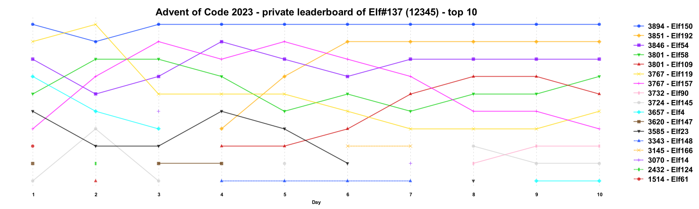

# advent-of-code

## Solutions

- [2023](aoc2023/src/main/kotlin/com/github/fstaudt/aoc2023)

## Gradle tasks

### Leaderboard slope chart

generate a slope chart for a private leaderboard

#### How-to

- clone repository

- store Advent of Code `Cookie` request header in file `cookie.txt` 

- run command:
``` shell
./gradlew leaderboardSlopeChart --year=<year> --id=<leaderboard-id> [--top=<top>] [--force]
```
- `year`: year of advent calendar
- `id`: ID of private leaderboard
- `top`: number of top members displayed in slope chart
- `force`: force download of leaderboard JSON\
  _By default, download is skipped if file `build/aoc/leaderboards/<year>/<id>.json` already exists._\
  :warning: _Please don't make frequent automated requests to Advent of code API._\
  :warning: _Avoid download of leaderboard JSON more often than once every 15 minutes (900 seconds)._

- Slope chart is generated in `build/aoc/leaderboards/<year>/<id>.json.png`

#### Example
``` shell
./gradlew leaderboardSlopeChart --year=2023 --id=12345 --top=10    # example uses a fake id
```



### Init day

generate base sources for requested day

#### How-to

- clone repository

- run command:
``` shell
./gradlew initDay [--day=<day>] [--year=<year>] [--force]
```
- `day`: day in advent calendar (defaults to current day of month)
- `year`: year of advent calendar (defaults to current year)
- `force`: overwrite existing sources

### Fetch day input

fetch input of current user for requested day

#### How-to

- clone repository

- store Advent of Code `Cookie` request header in file `cookie.txt`

- run command:
``` shell
./gradlew fetchDayInput [--day=<day>] [--year=<year>]
```
- `day`: day in advent calendar (defaults to current day of month)
- `year`: year of advent calendar (defaults to current year)
